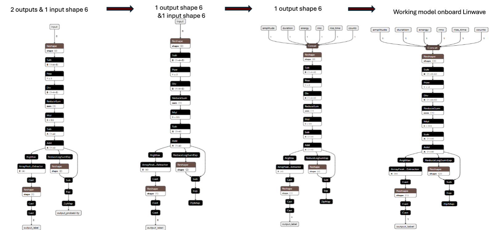
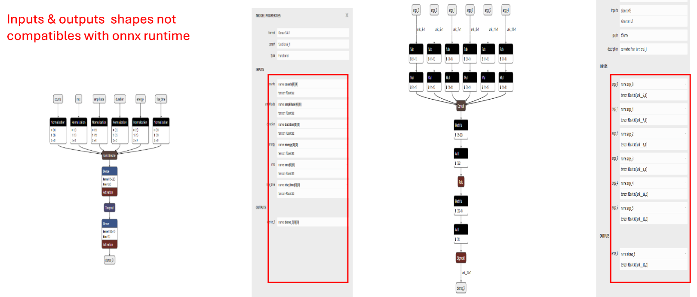
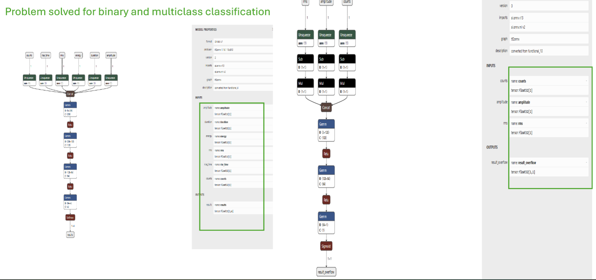

# onnx
To enable real-time, onboard inference using machine learning (ML) and deep learning (DL) models on the Vallen LinWave system, models are first trained in standard frameworks such as PyTorch or TensorFlow and then exported to the Open Neural Network Exchange (ONNX) format. ONNX provides a hardware-agnostic, lightweight representation that allows for efficient integration with embedded systems and industrial platforms. By converting models to ONNX, we ensure compatibility with the Vallen LINUS data acquisition pipeline and enable edge-level processing of acoustic emission (AE) signals for tasks such as anomaly detection, signal classification, or predictive maintenance. This transformation allows the LinWave system to execute inference with low latency directly at the sensor node, minimizing data transfer requirements and enabling closed-loop monitoring in harsh or bandwidth-limited environments
# ML Model

## DL Model

